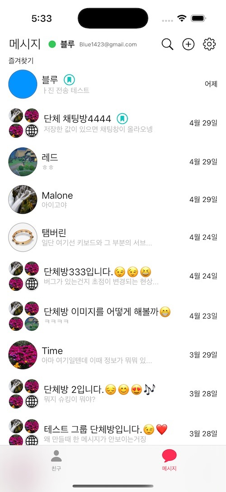
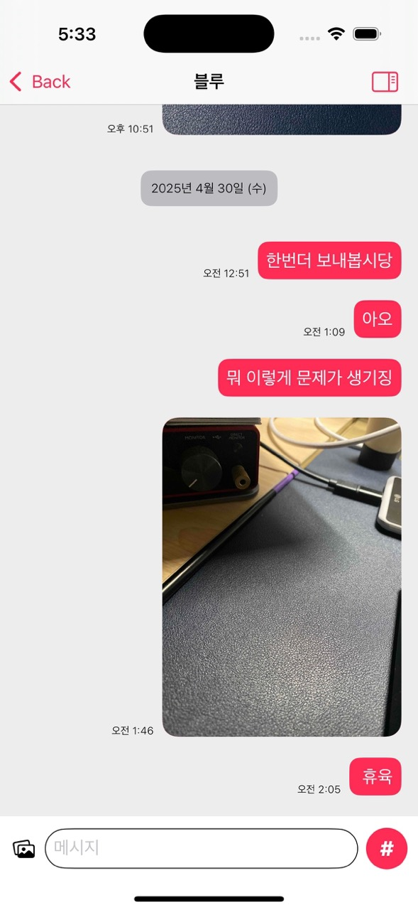
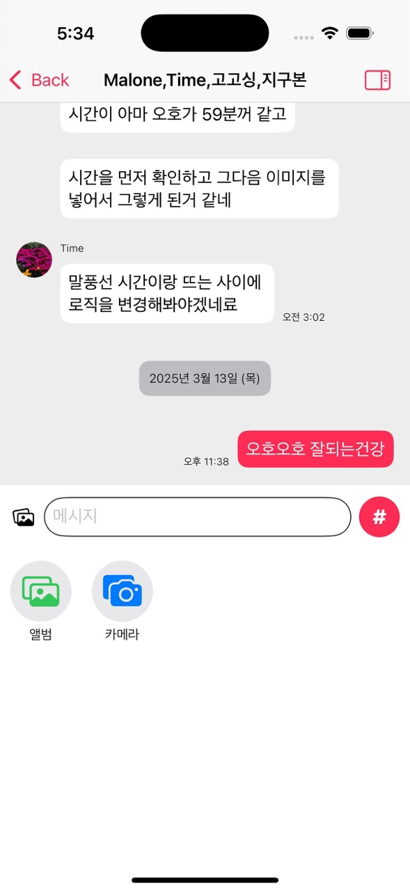
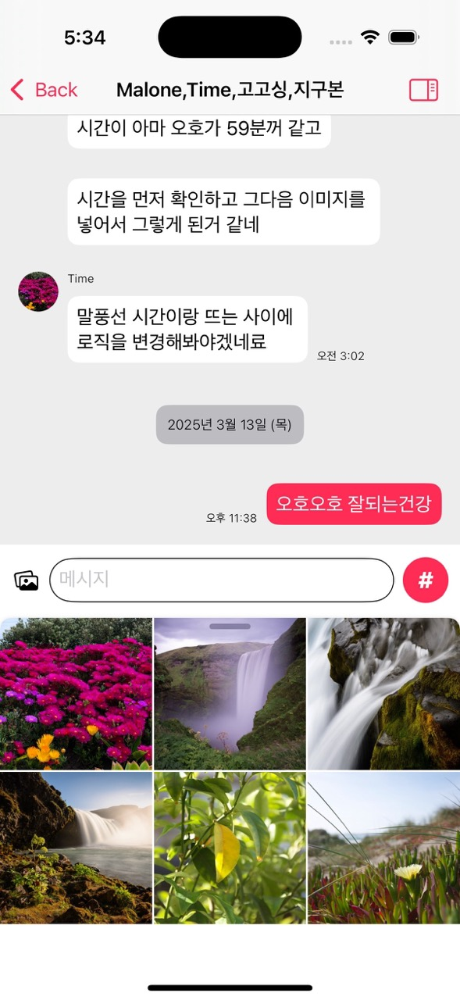
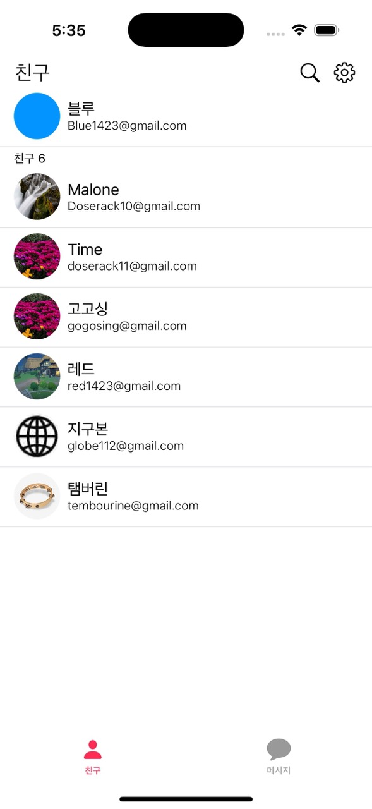

# ChatApp

A chat application built with SwiftUI.

## Features
- User registration and login
- Real-time messaging (text and image sharing)
- User list browsing and group chat room creation
- Camera Capture and Sending Image

## Requirements
- iOS 17.4 or later

## Technologies Used 
- SwiftUI
- Firebase Authentication, Storage, Firestore
- SDWebImageSwiftUI

## Screenshot

  
  
  

  
  
  

